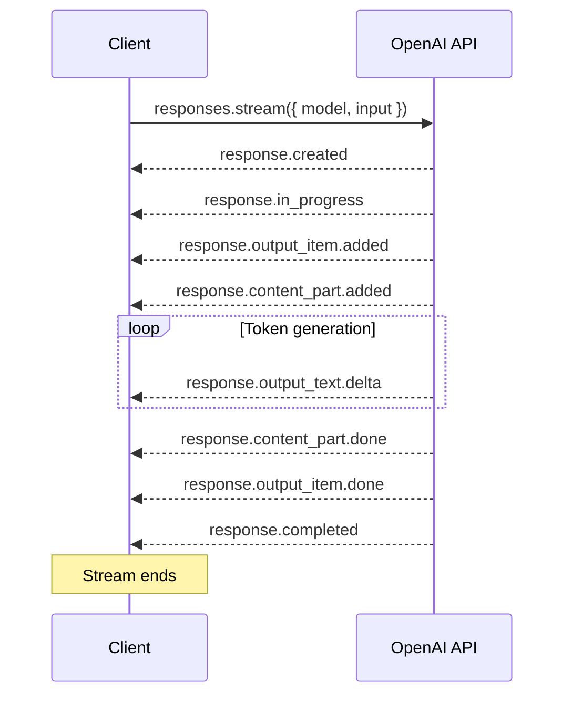
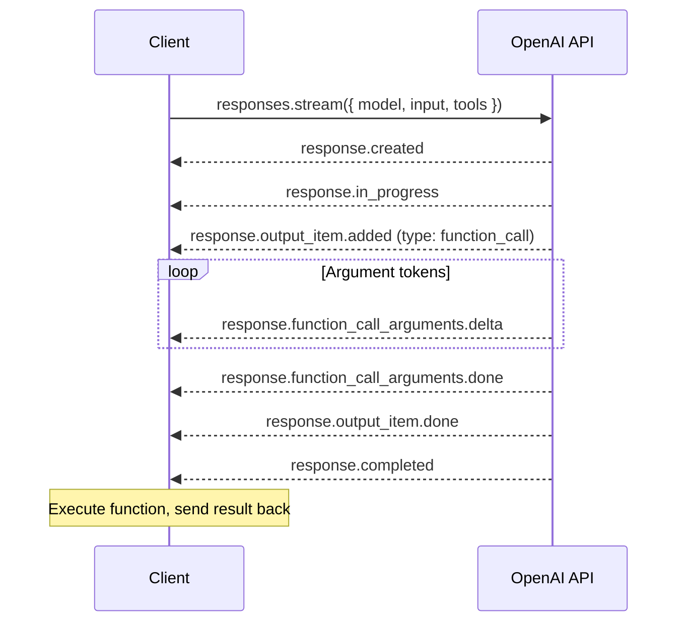
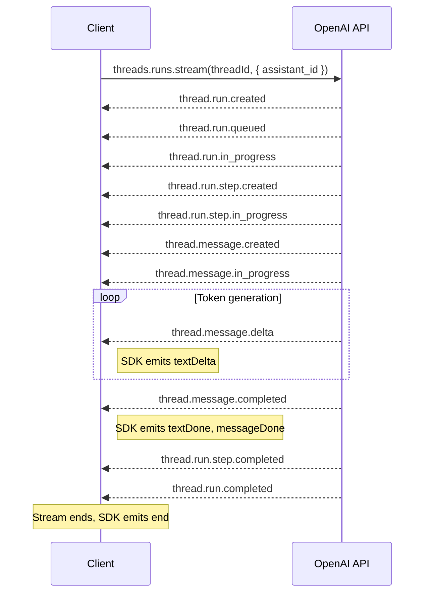

# Structured Outputs Parsing Helpers

The OpenAI API supports extracting JSON from the model with the `response_format` request param, for more details on the API, see [this guide](https://platform.openai.com/docs/guides/structured-outputs).

The SDK provides a `client.chat.completions.parse()` method which is a wrapper over the `client.chat.completions.create()` that
provides richer integrations with TS specific types & returns a `ParsedChatCompletion` object, which is an extension of the standard `ChatCompletion` type.

## Auto-parsing response content with Zod schemas

You can pass zod schemas wrapped with `zodResponseFormat()` to the `.parse()` method and the SDK will automatically convert the model
into a JSON schema, send it to the API and parse the response content back using the given zod schema.

```ts
import { zodResponseFormat } from 'openai/helpers/zod';
import OpenAI from 'openai/index';
import { z } from 'zod/v3';

const Step = z.object({
  explanation: z.string(),
  output: z.string(),
});

const MathResponse = z.object({
  steps: z.array(Step),
  final_answer: z.string(),
});

const client = new OpenAI();

const completion = await client.chat.completions.parse({
  model: 'gpt-4o-2024-08-06',
  messages: [
    { role: 'system', content: 'You are a helpful math tutor.' },
    { role: 'user', content: 'solve 8x + 31 = 2' },
  ],
  response_format: zodResponseFormat(MathResponse, 'math_response'),
});

console.dir(completion, { depth: 5 });

const message = completion.choices[0]?.message;
if (message?.parsed) {
  console.log(message.parsed.steps);
  console.log(`answer: ${message.parsed.final_answer}`);
}
```

## Auto-parsing function tool calls

The `.parse()` method will also automatically parse `function` tool calls if:

- You use the `zodFunction()` helper method
- You mark your tool schema with `"strict": True`

For example:

```ts
import { zodFunction } from 'openai/helpers/zod';
import OpenAI from 'openai/index';
import { z } from 'zod/v3';

const Table = z.enum(['orders', 'customers', 'products']);

const Column = z.enum([
  'id',
  'status',
  'expected_delivery_date',
  'delivered_at',
  'shipped_at',
  'ordered_at',
  'canceled_at',
]);

const Operator = z.enum(['=', '>', '<', '<=', '>=', '!=']);

const OrderBy = z.enum(['asc', 'desc']);

const DynamicValue = z.object({
  column_name: z.string(),
});

const Condition = z.object({
  column: z.string(),
  operator: Operator,
  value: z.union([z.string(), z.number(), DynamicValue]),
});

const Query = z.object({
  table_name: Table,
  columns: z.array(Column),
  conditions: z.array(Condition),
  order_by: OrderBy,
});

const client = new OpenAI();
const completion = await client.chat.completions.parse({
  model: 'gpt-4o-2024-08-06',
  messages: [
    {
      role: 'system',
      content:
        'You are a helpful assistant. The current date is August 6, 2024. You help users query for the data they are looking for by calling the query function.',
    },
    {
      role: 'user',
      content: 'look up all my orders in november of last year that were fulfilled but not delivered on time',
    },
  ],
  tools: [zodFunction({ name: 'query', parameters: Query })],
});
console.dir(completion, { depth: 10 });

const toolCall = completion.choices[0]?.message.tool_calls?.[0];
if (toolCall) {
  const args = toolCall.function.parsed_arguments as z.infer<typeof Query>;
  console.log(args);
  console.log(args.table_name);
}

main();
```

### Differences from `.create()`

The `chat.completions.parse()` method imposes some additional restrictions on it's usage that `chat.completions.create()` does not.

- If the completion completes with `finish_reason` set to `length` or `content_filter`, the `LengthFinishReasonError` / `ContentFilterFinishReasonError` errors will be raised.
- Only strict function tools can be passed, e.g. `{type: 'function', function: {..., strict: true}}`

# Streaming Helpers

OpenAI supports streaming responses when interacting with the [Responses](#responses-streaming), [Chat](#chat-streaming), or [Assistant](#assistant-streaming-api) APIs.

## Responses Streaming

The Responses API supports streaming via Server-Sent Events. The SDK provides a `.stream()` helper
that lets you subscribe to typed events as they arrive.

### Event lifecycle

The following diagram shows the sequence of events emitted during a typical Responses API stream:



### Basic streaming example

```ts
import OpenAI from 'openai';

const client = new OpenAI();

const stream = client.responses.stream({
  model: 'gpt-4o',
  input: 'Explain how streaming works in three sentences.',
});

// Subscribe to specific event types
stream.on('response.output_text.delta', (event) => {
  process.stdout.write(event.delta);
});

stream.on('response.completed', (event) => {
  console.log('\n\nDone. Usage:', event.response.usage);
});

// Or iterate over all events
for await (const event of stream) {
  if (event.type === 'response.output_text.delta') {
    process.stdout.write(event.delta);
  }
}
```

### Responses stream events

Every event has a `type` field you can match on. The main event types are:

| Event type | Description |
| --- | --- |
| `response.created` | Response object created |
| `response.in_progress` | Generation has started |
| `response.output_item.added` | A new output item (message, tool call, etc.) was added |
| `response.content_part.added` | A new content part was added to an output item |
| `response.output_text.delta` | A text chunk was generated (has `delta` and `snapshot` fields) |
| `response.output_text.done` | Text generation finished for this content part |
| `response.function_call_arguments.delta` | A chunk of function call arguments (has `delta` and `snapshot` fields) |
| `response.function_call_arguments.done` | Function call arguments are complete |
| `response.content_part.done` | Content part is complete |
| `response.output_item.done` | Output item is complete |
| `response.completed` | The full response is complete |
| `response.failed` | The response failed |
| `response.incomplete` | The response was cut short (e.g., max tokens) |

### Responses streaming with tool calls

When the model calls a function tool, the event flow changes:



### Helper methods

The stream object provides convenience methods to collect final results:

```ts
const stream = client.responses.stream({ model: 'gpt-4o', input: '...' });

const response = await stream.finalResponse(); // Wait for the complete Response object
```

## Assistant Streaming API

OpenAI supports streaming responses from Assistants. The SDK provides convenience wrappers around the API
so you can subscribe to the types of events you are interested in as well as receive accumulated responses.

More information can be found in the documentation: [Assistant Streaming](https://platform.openai.com/docs/assistants/overview?lang=node.js)

### Understanding assistant stream events

The Assistants API sends raw SSE events with names like `thread.run.created`, `thread.message.delta`, etc.
The SDK's streaming helper maps these to **convenience event names** (like `textDelta`, `toolCallCreated`)
so you can subscribe to higher-level concepts without parsing raw events yourself.

**You can use either approach:**

1. **Convenience events** -- camelCase names like `textDelta`, `runStepCreated` (shown in the example below)
2. **Raw events** -- use `.on('event', callback)` to receive every SSE event with its original `thread.*` type

Here's how the convenience events map to the underlying SSE events:

| Convenience event | Triggered by raw SSE event(s) | Callback signature |
| --- | --- | --- |
| `event` | _all events_ | `(event: AssistantStreamEvent) => void` |
| `runStepCreated` | `thread.run.step.created` | `(runStep: RunStep) => void` |
| `runStepDelta` | `thread.run.step.delta` | `(delta: RunStepDelta, snapshot: RunStep) => void` |
| `runStepDone` | `thread.run.step.completed` | `(runStep: RunStep) => void` |
| `messageCreated` | `thread.message.created` | `(message: Message) => void` |
| `messageDelta` | `thread.message.delta` | `(delta: MessageDelta, snapshot: Message) => void` |
| `messageDone` | `thread.message.completed` | `(message: Message) => void` |
| `textCreated` | `thread.message.delta` (first text content) | `(content: Text) => void` |
| `textDelta` | `thread.message.delta` (subsequent text) | `(delta: TextDelta, snapshot: Text) => void` |
| `textDone` | `thread.message.completed` | `(content: Text, snapshot: Message) => void` |
| `toolCallCreated` | `thread.run.step.delta` (first tool call) | `(toolCall: ToolCall) => void` |
| `toolCallDelta` | `thread.run.step.delta` (subsequent) | `(delta: ToolCallDelta, snapshot: ToolCall) => void` |
| `toolCallDone` | `thread.run.step.completed` | `(toolCall: ToolCall) => void` |
| `imageFileDone` | `thread.message.completed` | `(content: ImageFile, snapshot: Message) => void` |
| `end` | stream closed | `() => void` |

### Assistant streaming lifecycle



#### Example: using convenience events

```ts
const run = openai.beta.threads.runs
  .stream(thread.id, { assistant_id: assistant.id })
  .on('textCreated', () => process.stdout.write('\nassistant > '))
  .on('textDelta', (textDelta) => process.stdout.write(textDelta.value ?? ''))
  .on('toolCallCreated', (toolCall) => process.stdout.write(`\nassistant > ${toolCall.type}\n\n`))
  .on('toolCallDelta', (toolCallDelta) => {
    if (toolCallDelta.type === 'code_interpreter') {
      if (toolCallDelta.code_interpreter?.input) {
        process.stdout.write(toolCallDelta.code_interpreter.input);
      }
      if (toolCallDelta.code_interpreter?.outputs) {
        process.stdout.write('\noutput >\n');
        toolCallDelta.code_interpreter.outputs.forEach((output) => {
          if (output.type === 'logs') {
            process.stdout.write(`\n${output.logs}\n`);
          }
        });
      }
    }
  });
```

#### Example: using raw events

If you need access to events like `thread.run.completed` or `thread.run.requires_action`
that don't have convenience wrappers, use the `event` listener:

```ts
const run = openai.beta.threads.runs
  .stream(thread.id, { assistant_id: assistant.id })
  .on('event', ({ event, data }) => {
    switch (event) {
      case 'thread.run.completed':
        console.log('Run finished:', data.id);
        break;
      case 'thread.run.requires_action':
        console.log('Action required:', data.required_action);
        break;
      case 'thread.message.delta':
        const chunk = data.delta.content?.[0];
        if (chunk && 'text' in chunk && chunk.text?.value) {
          process.stdout.write(chunk.text.value);
        }
        break;
    }
  });
```

### Starting a stream

There are three helper methods for creating streams:

```ts
openai.beta.threads.runs.stream();
```

This method can be used to start and stream the response to an existing run with an associated thread
that is already populated with messages.

```ts
openai.beta.threads.createAndRunStream();
```

This method can be used to add a message to a thread, start a run and then stream the response.

```ts
openai.beta.threads.runs.submitToolOutputsStream();
```

This method can be used to submit a tool output to a run waiting on the output and start a stream.

### Assistant Events Reference

The assistant API provides two ways to subscribe to events:

#### Raw event listener

```ts
.on('event', (event: AssistantStreamEvent) => ...)
```

Receives every SSE event from the API with its original type (e.g., `thread.run.completed`,
`thread.message.delta`). The full list of raw event types is documented in the
[API reference](https://platform.openai.com/docs/api-reference/assistants-streaming/events).
Use this when you need events like `thread.run.completed` or `thread.run.requires_action` that
don't have convenience wrappers.

#### Convenience event listeners

These fire at meaningful moments during the stream, derived from the raw events above.
See the [mapping table](#understanding-assistant-stream-events) for which raw events trigger each one.

```ts
.on('runStepCreated', (runStep: RunStep) => ...)
.on('runStepDelta', (delta: RunStepDelta, snapshot: RunStep) => ...)
.on('runStepDone', (runStep: RunStep) => ...)
```

Subscribe to the creation, delta, and completion of a RunStep.
See [Runs and RunSteps](https://platform.openai.com/docs/assistants/how-it-works/runs-and-run-steps).

```ts
.on('messageCreated', (message: Message) => ...)
.on('messageDelta', (delta: MessageDelta, snapshot: Message) => ...)
.on('messageDone', (message: Message) => ...)
```

Subscribe to Message creation, delta, and completion events. The delta callback includes both the
incremental update and an accumulated snapshot.
See [Message object](https://platform.openai.com/docs/api-reference/messages/object).

```ts
.on('textCreated', (content: Text) => ...)
.on('textDelta', (delta: TextDelta, snapshot: Text) => ...)
.on('textDone', (content: Text, snapshot: Message) => ...)
```

Subscribe to text content creation, deltas, and completion. The delta callback includes both the
incremental update and an accumulated snapshot.

```ts
.on('imageFileDone', (content: ImageFile, snapshot: Message) => ...)
```

Image files are not sent incrementally, so only a completion event is provided.

```ts
.on('toolCallCreated', (toolCall: ToolCall) => ...)
.on('toolCallDelta', (delta: RunStepDelta, snapshot: ToolCall) => ...)
.on('toolCallDone', (toolCall: ToolCall) => ...)
```

Subscribe to ToolCall creation, deltas, and completion.
See [Tools](https://platform.openai.com/docs/assistants/tools).

```ts
.on('end', () => ...)
```

The last event fired when a stream ends.

### Assistant Methods

The assistant streaming object also provides a few methods for convenience:

```ts
.currentEvent(): AssistantStreamEvent | undefined

.currentRun(): Run | undefined

.currentMessageSnapshot(): Message

.currentRunStepSnapshot(): Runs.RunStep
```

These methods are provided to allow you to access additional context from within event handlers. In many cases
the handlers should include all the information you need for processing, but if additional context is required it
can be accessed.

Note: There is not always a relevant context in certain situations (these will be `undefined` in those cases).

```ts
await .finalMessages() : Promise<Message[]>

await .finalRunSteps(): Promise<RunStep[]>
```

These methods are provided for convenience to collect information at the end of a stream. Calling these events
will trigger consumption of the stream until completion and then return the relevant accumulated objects.

## Chat Streaming

### Streaming Responses

```ts
openai.chat.completions.stream({ stream?: false, … }, options?): ChatCompletionStreamingRunner
```

`openai.chat.completions.stream()` returns a `ChatCompletionStreamingRunner`, which emits events, has an async
iterator, and exposes helper methods to accumulate chunks into a convenient shape and make it easy to reason
about the conversation.

Alternatively, you can use `openai.chat.completions.create({ stream: true, … })` which returns an async
iterable of the chunks in the stream and uses less memory (most notably, it does not accumulate a final chat
completion object for you).

If you need to cancel a stream, you can `break` from a `for await` loop or call `stream.abort()`.

See an example of streaming helpers in action in [`examples/stream.ts`](examples/stream.ts).

### Automated function calls

We provide the `openai.chat.completions.runTools({…})`
convenience helper for using function tool calls with the `/chat/completions` endpoint
which automatically call the JavaScript functions you provide
and sends their results back to the `/chat/completions` endpoint,
looping as long as the model requests tool calls.

If you pass a `parse` function, it will automatically parse the `arguments` for you
and returns any parsing errors to the model to attempt auto-recovery.
Otherwise, the args will be passed to the function you provide as a string.

If you pass `tool_choice: {function: {name: …}}` instead of `auto`,
it returns immediately after calling that function (and only loops to auto-recover parsing errors).

```ts
import OpenAI from 'openai';

const client = new OpenAI();

async function main() {
  const runner = client.chat.completions
    .runTools({
      model: 'gpt-4o',
      messages: [{ role: 'user', content: 'How is the weather this week?' }],
      tools: [
        {
          type: 'function',
          function: {
            function: getCurrentLocation,
            parameters: { type: 'object', properties: {} },
          },
        },
        {
          type: 'function',
          function: {
            function: getWeather,
            parse: JSON.parse, // or use a validation library like zod for typesafe parsing.
            parameters: {
              type: 'object',
              properties: {
                location: { type: 'string' },
              },
            },
          },
        },
      ],
    })
    .on('message', (message) => console.log(message));

  const finalContent = await runner.finalContent();
  console.log();
  console.log('Final content:', finalContent);
}

async function getCurrentLocation() {
  return 'Boston'; // Simulate lookup
}

async function getWeather(args: { location: string }) {
  const { location } = args;
  // … do lookup …
  return { temperature, precipitation };
}

main();

// {role: "user",      content: "How's the weather this week?"}
// {role: "assistant", tool_calls: [{type: "function", function: {name: "getCurrentLocation", arguments: "{}"}, id: "123"}
// {role: "tool",      name: "getCurrentLocation", content: "Boston", tool_call_id: "123"}
// {role: "assistant", tool_calls: [{type: "function", function: {name: "getWeather", arguments: '{"location": "Boston"}'}, id: "1234"}]}
// {role: "tool",      name: "getWeather", content: '{"temperature": "50degF", "preciptation": "high"}', tool_call_id: "1234"}
// {role: "assistant", content: "It's looking cold and rainy - you might want to wear a jacket!"}
//
// Final content: "It's looking cold and rainy - you might want to wear a jacket!"
```

Like with `.stream()`, we provide a variety of [helpers and events](helpers.md#chat-events).

Read more about various examples such as with integrating with [zod](#integrate-with-zod),
[next.js](#integrate-with-nextjs), and [proxying a stream to the browser](#proxy-streaming-to-a-browser).

By default, we run the loop up to 10 chat completions from the API. You can change this behavior by
adjusting `maxChatCompletions` in the request options object. Note that `max_tokens` is the limit per
chat completion request, not for the entire call run.

See an example of automated function calls in action in
[`examples/function-call-helpers.ts`](examples/function-call-helpers.ts).

Note, `runFunctions` was also previously available, but has been deprecated in favor of `runTools`.

### Chat Events

#### `.on('connect', () => …)`

The first event that is fired when the connection with the OpenAI API is established.

#### `.on('chunk', (chunk: ChatCompletionChunk, snapshot: ChatCompletionSnapshot) => …)` (with `stream`)

The event fired when a chunk is received from the API. Not fired when it is not streaming. The snapshot
returns an accumulated `ChatCompletionSnapshot`, which has a similar shape to `ChatCompletion` with optional
fields and is built up from the chunks.

#### `.on('chatCompletion', (completion: ChatCompletion) => …)`

The event fired when a chat completion is returned or done being streamed by the API.

#### `.on('message', (message: ChatCompletionMessageParam) => …)`

The event fired when a new message is either sent or received from the API. Does not fire for the messages
sent as the parameter to either `.runTools()` or `.stream()`

#### `.on('content', (content: string) => …)` (without `stream`)

The event fired when a message from the `assistant` is received from the API.

#### `.on('content', (delta: string, snapshot: string) => …)` (with `stream`)

The event fired when a chunk from the `assistant` is received from the API. The `delta` argument contains the
content of the chunk, while the `snapshot` returns the accumulated content for the current message.

#### `.on('functionCall', (functionCall: ChatCompletionMessage.FunctionCall) => …)`

The event fired when a function call is made by the assistant.

#### `.on('functionCallResult', (content: string) => …)`

The event fired when the function runner responds to the function call with `role: "function"`. The `content` of the
response is given as the first argument to the callback.

#### `.on('content.delta', (props: ContentDeltaEvent) => ...)`

The event fired for every chunk containing new content. The `props` object contains:
- `delta`: The new content string received in this chunk
- `snapshot`: The accumulated content so far
- `parsed`: The partially parsed content (if applicable)

#### `.on('content.done', (props: ContentDoneEvent<ParsedT>) => ...)`

The event fired when the content generation is complete. The `props` object contains:
- `content`: The full generated content
- `parsed`: The fully parsed content (if applicable)

#### `.on('refusal.delta', (props: RefusalDeltaEvent) => ...)`

The event fired when a chunk contains part of a content refusal. The `props` object contains:
- `delta`: The new refusal content string received in this chunk
- `snapshot`: The accumulated refusal content string so far

#### `.on('refusal.done', (props: RefusalDoneEvent) => ...)`

The event fired when the refusal content is complete. The `props` object contains:
- `refusal`: The full refusal content

#### `.on('tool_calls.function.arguments.delta', (props: FunctionToolCallArgumentsDeltaEvent) => ...)`

The event fired when a chunk contains part of a function tool call's arguments. The `props` object contains:
- `name`: The name of the function being called
- `index`: The index of the tool call
- `arguments`: The accumulated raw JSON string of arguments
- `parsed_arguments`: The partially parsed arguments object
- `arguments_delta`: The new JSON string fragment received in this chunk

#### `.on('tool_calls.function.arguments.done', (props: FunctionToolCallArgumentsDoneEvent) => ...)`

The event fired when a function tool call's arguments are complete. The `props` object contains:
- `name`: The name of the function being called
- `index`: The index of the tool call
- `arguments`: The full raw JSON string of arguments
- `parsed_arguments`: The fully parsed arguments object

#### `.on('logprobs.content.delta', (props: LogProbsContentDeltaEvent) => ...)`

The event fired when a chunk contains new content log probabilities. The `props` object contains:
- `content`: A list of the new log probabilities received in this chunk
- `snapshot`: A list of the accumulated log probabilities so far

#### `.on('logprobs.content.done', (props: LogProbsContentDoneEvent) => ...)`

The event fired when all content log probabilities have been received. The `props` object contains:
- `content`: The full list of token log probabilities for the content

#### `.on('logprobs.refusal.delta', (props: LogProbsRefusalDeltaEvent) => ...)`

The event fired when a chunk contains new refusal log probabilities. The `props` object contains:
- `refusal`: A list of the new log probabilities received in this chunk
- `snapshot`: A list of the accumulated log probabilities so far

#### `.on('logprobs.refusal.done', (props: LogProbsRefusalDoneEvent) => ...)`

The event fired when all refusal log probabilities have been received. The `props` object contains:
- `refusal`: The full list of token log probabilities for the refusal

#### `.on('finalChatCompletion', (completion: ChatCompletion) => …)`

The event fired for the final chat completion. If the function call runner exceeds the number
`maxChatCompletions`, then the last chat completion is given.

#### `.on('finalContent', (contentSnapshot: string) => …)`

The event fired for the `content` of the last `role: "assistant"` message. Not fired if there is no `assistant`
message.

#### `.on('finalMessage', (message: ChatCompletionMessage) => …)`

The event fired for the last message.

#### `.on('finalFunctionCall', (functionCall: ChatCompletionMessage.FunctionCall) => …)`

The event fired for the last message with a defined `function_call`.

#### `.on('finalFunctionCallResult', (content: string) => …)`

The event fired for the last message with a `role: "function"`.

#### `.on('error', (error: OpenAIError) => …)`

The event fired when an error is encountered outside of a `parse` function or an abort.

#### `.on('abort', (error: APIUserAbortError) => …)`

The event fired when the stream receives a signal to abort.

#### `.on('totalUsage', (usage: CompletionUsage) => …)` (without `stream`, usage is not currently reported with `stream`)

The event fired at the end, returning the total usage of the call.

#### `.on('end', () => …)`

The last event fired in the stream.

### Chat Methods

#### `.abort()`

Aborts the runner and the streaming request, equivalent to `.controller.abort()`. Calling `.abort()` on a
`ChatCompletionStreamingRunner` will also abort any in-flight network requests.

#### `await .done()`

An empty promise which resolves when the stream is done.

#### `await .finalChatCompletion()`

A promise which resolves with the final chat completion that was received from the API. Throws if the request
ends before a complete chat completion is returned.

#### `await .allChatCompletions()`

A promise which resolves with The array of all chat completions that were received from the API.

#### `await .finalContent()`

A promise which resolves with the `content` of the last `role: "assistant"` message. Throws if no such message
can be found.

#### `await .finalMessage()`

A promise which resolves with the last message.

#### `await .finalFunctionCall()`

A promise which resolves with the last message with a defined `function_call`. Throws if no such message is
found.

#### `await .finalFunctionCallResult()`

A promise which resolves with the last message with a `role: "function"`. Throws if no such message is found.

#### `await .totalUsage()` (without `stream`, usage is not currently reported with `stream`)

A promise which resolves with the total usage.

### Chat Fields

#### `.messages`

A mutable array of all messages in the conversation.

#### `.controller`

The underlying `AbortController` for the runner.

### Chat Examples

#### Abort on a function call

If you have a function call flow which you intend to _end_ with a certain function call, then you can use the second
argument `runner` given to the function to either mutate `runner.messages` or call `runner.abort()`.

```ts
import OpenAI from 'openai';

const client = new OpenAI();

async function main() {
  const runner = client.chat.completions
    .runTools({
      model: 'gpt-3.5-turbo',
      messages: [{ role: 'user', content: "How's the weather this week in Los Angeles?" }],
      tools: [
        {
          type: 'function',
          function: {
            function: function updateDatabase(props, runner) {
              runner.abort()
            },
            …
          }
        },
      ],
    })
    .on('message', (message) => console.log(message));

  const finalFunctionCall = await runner.finalFunctionCall();
  console.log('Final function call:', finalFunctionCall);
}

main();
```

#### Integrate with `zod`

[`zod`](https://www.npmjs.com/package/zod) is a schema validation library which can help with validating the
assistant's response to make sure it conforms to a schema. Paired with [`zod-to-json-schema`](https://www.npmjs.com/package/zod-to-json-schema), the validation schema also acts as the `parameters` JSON Schema passed to the API.

```ts
import OpenAI from 'openai';
import { z } from 'zod/v3';
import { zodToJsonSchema } from 'zod-to-json-schema';

const client = new OpenAI();

async function main() {
  const runner = client.chat.completions
    .runTools({
      model: 'gpt-3.5-turbo',
      messages: [{ role: 'user', content: "How's the weather this week in Los Angeles?" }],
      tools: [
        {
          type: 'function',
          function: {
            function: getWeather,
            parse: GetWeatherParameters.parse,
            parameters: zodToJsonSchema(GetWeatherParameters),
          },
        },
      ],
    })
    .on('message', (message) => console.log(message));

  const finalContent = await runner.finalContent();
  console.log('Final content:', finalContent);
}

const GetWeatherParameters = z.object({
  location: z.enum(['Boston', 'New York City', 'Los Angeles', 'San Francisco']),
});

async function getWeather(args: z.infer<typeof GetWeatherParameters>) {
  const { location } = args;
  // … do lookup …
  return { temperature, precipitation };
}

main();
```

See a more fully-fledged example in [`examples/function-call-helpers-zod.ts`](examples/function-call-helpers-zod.ts).

#### Integrate with Next.JS

See an example of a Next.JS integration here [`examples/stream-to-client-next.ts`](examples/stream-to-client-next.ts).

#### Proxy Streaming to a Browser

See an example of using express to stream to a browser here [`examples/stream-to-client-express.ts`](examples/stream-to-client-express.ts).

# Polling Helpers

When interacting with the API some actions such as starting a Run and adding files to vector stores are asynchronous and take time to complete.
The SDK includes helper functions which will poll the status until it reaches a terminal state and then return the resulting object.
If an API method results in an action which could benefit from polling there will be a corresponding version of the
method ending in `_AndPoll`.

All methods also allow you to set the polling frequency, how often the API is checked for an update, via a function argument (`pollIntervalMs`).

The polling methods are:

```ts
client.beta.threads.createAndRunPoll(...)
client.beta.threads.runs.createAndPoll((...)
client.beta.threads.runs.submitToolOutputsAndPoll((...)
client.beta.vectorStores.files.uploadAndPoll((...)
client.beta.vectorStores.files.createAndPoll((...)
client.beta.vectorStores.fileBatches.createAndPoll((...)
client.beta.vectorStores.fileBatches.uploadAndPoll((...)
```

# Bulk Upload Helpers

When creating and interacting with vector stores, you can use the polling helpers to monitor the status of operations.
For convenience, we also provide a bulk upload helper to allow you to simultaneously upload several files at once.

```ts
const fileList = [
  createReadStream('/home/data/example.pdf'),
  ...
];

const batch = await openai.vectorStores.fileBatches.uploadAndPoll(vectorStore.id, {files: fileList});
```
